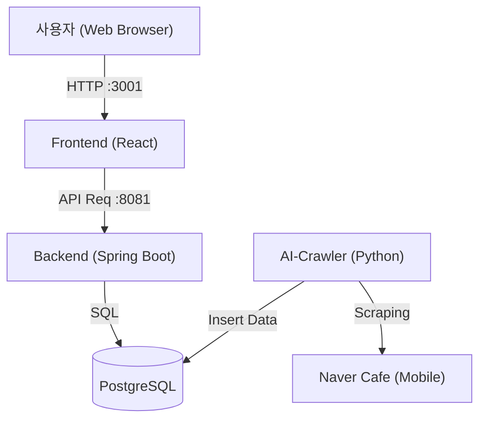

# TeacherHub 개발자 가이드 (Technical Wiki)

## 1. 프로젝트 개요
**TeacherHub**는 특정 강사(또는 키워드)에 대한 커뮤니티 반응을 실시간으로 수집하고, 감성 분석을 통해 평판을 모니터링하는 **마이크로서비스 기반 대시보드 시스템**입니다. 
네이버 카페와 같은 커뮤니티 사이트에서 게시글을 크롤링하고, 이를 분석하여 긍정/부정 여부를 판단한 뒤, 웹 대시보드를 통해 시각화된 통계 정보를 제공합니다.

---

## 2. 시스템 아키텍처
본 프로젝트는 **Docker Compose**를 사용하여 4개의 컨테이너 서비스로 구성된 마이크로서비스 아키텍처를 따르고 있습니다.

### 아키텍처 다이어그램


### 서비스 구성 요소
| 서비스명 | 기술 스택 | 역할 | Docker 서비스명 | 포트 (Host:Container) |
|---|---|---|---|---|
| **Frontend** | React, Material-UI, Chart.js, Nginx(Base image) | 사용자 대시보드 UI 제공, 통계 시각화 | `frontend` | 3001:3000 |
| **Backend** | Java 17, Spring Boot 3.x, JPA | API 서버, DB 데이터 조회 및 집계 | `backend` | 8081:8080 |
| **Data Store** | PostgreSQL 15 | 수집된 데이터 및 분석 결과 저장 | `db` | 5432:5432 |
| **AI-Crawler** | Python 3.10, Playwright, Pandas, TextBlob | 웹 크롤링, 감성 분석, DB 적재 | `ai-crawler` | N/A |

---

## 3. 상세 구현 내용

### 3.1. AI-Crawler (데이터 수집 및 분석)
*   **위치**: `ai-crawler/`
*   **핵심 기술**:
    *   **Playwright**: 동적 웹 페이지 크롤링을 위해 사용. 네이버 카페의 PC 버전은 iframe 구조가 복잡하고 봇 탐지가 심해, **모바일 웹(`m.cafe.naver.com`)**을 타겟으로 하여 안정성을 확보함.
    *   **User-Agent Rotaion**: 모바일 기기(Android) User-Agent를 사용하여 봇 탐지 회피.
    *   **Sentiment Analysis**: `TextBlob` 라이브러리를 이용한 Rule-based(키워드 기반) 감성 분석 샘플 구현. (향후 KoELECTRA 등 딥러닝 모델로 고도화 가능)
*   **주요 로직**:
    1.  환경변수(`NAVER_ID`, `NAVER_PW`)를 통한 네이버 자동 로그인 (Clipboard Copy-Paste 방식 우회 적용).
    2.  모바일 검색 페이지(`https://m.cafe.naver.com/.../search`) 직접 접근.
    3.  게시글 목록 파싱 (제목, 링크, 날짜, 댓글 수).
    4.  상세 페이지 이동 및 본문 크롤링.
    5.  PostgreSQL DB (`reputation_data` 테이블)에 결과 Upsert/Insert.
    6.  주기적 실행 (Schedule Loop, 현재 60초 간격).

### 3.2. Backend (API 서버)
*   **위치**: `backend/`
*   **핵심 기술**: Spring Boot, Spring Data JPA, Lombok.
*   **주요 API 엔드포인트**:
    *   `GET /api/reputation`: 전체 수집 데이터 목록 조회 (최신순).
    *   `GET /api/reputation/stats?keyword={keyword}`: 특정 키워드에 대한 통계 정보 제공.
        *   총 게시글 수 (`countByKeyword`)
        *   총 댓글 수 (`countTotalCommentsByKeyword`)
        *   최근 1년 월별 게시글 수 집계 (`findMonthlyStats` - JPQL Aggregation)
*   **데이터 모델 (`ReputationData`)**:
    *   `id`: PK
    *   `keyword`: 검색 키워드
    *   `title`, `content`: 게시글 정보
    *   `sentiment`, `score`: 감성 분석 결과
    *   `post_date`: 실제 게시글 작성일
    *   `created_at`: 수집(DB 적재) 일시

### 3.3. Frontend (대시보드)
*   **위치**: `frontend/`
*   **핵심 기술**: React, Axios, Material-UI (MUI), Chart.js (`react-chartjs-2`).
*   **주요 기능**:
    *   **실시간 모니터링**: `setInterval`을 이용해 10초마다 데이터 폴링 및 화면 갱신.
    *   **통계 시각화**: `ReputationStats` 컴포넌트에서 월별 게시글 추이를 막대그래프로 표현.
    *   **반응형 리스트**: 수집된 게시글을 감성 상태(Color Chip)와 함께 리스트로 표시.
    *   **Docker 연동**: `REACT_APP_API_URL` 환경 변수를 통해 백엔드 API 주소를 동적으로 설정 가능.

### 3.4. Database
*   **위치**: `database/`
*   **스키마 (`init.sql`)**:
    ```sql
    CREATE TABLE reputation_data (
        id SERIAL PRIMARY KEY,
        keyword VARCHAR(255),
        site_name VARCHAR(255),
        title TEXT,
        url TEXT,
        sentiment VARCHAR(50),
        score DOUBLE PRECISION,
        post_date TIMESTAMP,
        comment_count INTEGER DEFAULT 0,
        created_at TIMESTAMP DEFAULT CURRENT_TIMESTAMP
    );
    ```

---

## 4. 설치 및 실행 가이드

### 사전 요구사항
*   Docker & Docker Compose 설치 필수
*   Git 설치

### 실행 방법 
1. **리포지토리 클론**:
   ```bash
   git clone https://github.com/your-repo/TeacherHub.git
   cd TeacherHub
   ```

2. **환경 변수 설정**:
   `.env` 파일을 생성하고 네이버 계정 정보 입력 (크롤링용).
   ```bash
   NAVER_ID=your_naver_id
   NAVER_PW=your_naver_password
   ```

3. **서비스 실행**:
   ```bash
   docker-compose up -d --build
   ```

4. **접속**:
   *   **Frontend Dashboard**: [http://localhost:3001](http://localhost:3001) (또는 설정된 호스트)
   *   **Backend API**: [http://localhost:8081/api/reputation](http://localhost:8081/api/reputation)
   *   **DB 접속**: Port 5432 (User: `teacher`, PW: `password`, DB: `teacherhub`)

---

## 5. 트러블슈팅 및 팁
*   **크롤러 로그인 실패**: 네이버의 Captcha 정책으로 인해 로그인이 차단될 수 있습니다. 이 경우 PC 브라우저에서 해당 계정으로 로그인하여 차단을 해제하거나, IP를 변경해야 합니다.
*   **Frontend 'Chart.js' 오류**: Docker 빌드 시 `node_modules`가 갱신되지 않아 발생할 수 있습니다. `docker-compose up -d --build frontend`로 재빌드하거나, 컨테이너를 삭제(`docker rm -f`) 후 다시 실행하세요.
*   **모바일/PC 크롤링 전환**: 현재 모바일 웹(`m.cafe.naver.com`) 로직이 적용되어 있습니다. PC 버전으로 변경 시 `NaverCafeCrawler` 클래스의 초기화 로직과 Selector를 수정해야 합니다.

---

**작성일**: 2026-01-05
**작성자**: TeacherHub Development Team
